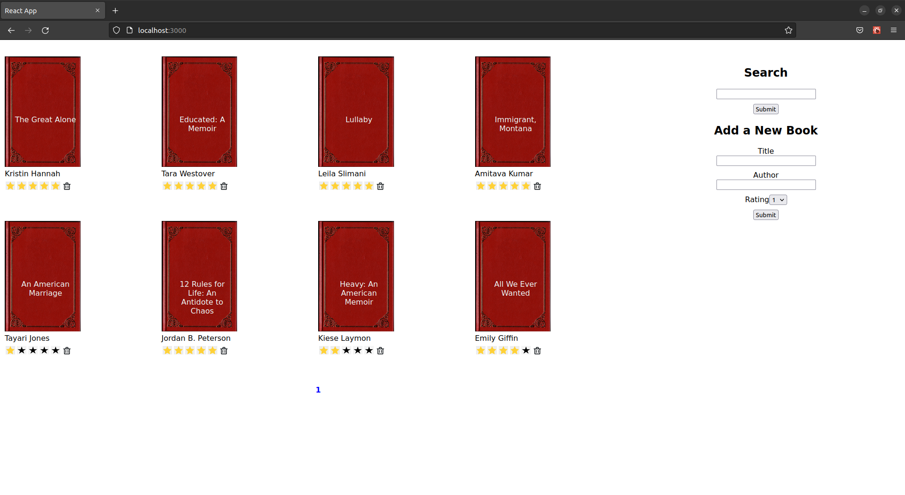

# Udacity Bookshelf

Udacity bookshelf is a platform that lists books to be read. A reader lives a thousand lives before he dies . . . The man who never reads lives only one.



## Getting Started

### Frontend setup

install node:
https://nodejs.org/en/download/package-manager/
install dependencies:
`npm install`
start app:
`npm start` 

### Backend setup
install python:
https://docs.python-guide.org/starting/installation/
setup an activate virtual environment:
https://virtualenv.pypa.io/en/latest/installation.html
`virtualenv venv`
`source bin/activate`
install required modules from requirements.txt file:
pip install -r requirements.txt
export FLASK_APP ENVIRONMENT variable:
export FLASK_APP=flaskr/
run flask app:
flask run

### Tests

python TDD_search.py

### API Reference
https://github.com/ENOCKMOSETI/Udacity-FSND/blob/main/apis/books/backend/README.md

### Deployment
#### Heroku

### Authors
Enock Moseti

### Acknowledgements
Udacity
African Leadership X


## Local Development 
The instructions below are meant for the local setup only. The classroom workspace is already set for your to start practicing. 

#### Pre-requisites
* Developers using this project should already have Python3, pip and node installed on their local machines.


* **Start your virtual environment** 
From the backend folder run
```bash
# Mac users
python3 -m venv venv
source venv/bin/activate
# Windows users
> py -3 -m venv venv
> venv\Scripts\activate
```

* **Install dependencies**<br>
From the backend folder run 
```bash
# All required packages are included in the requirements file. 
pip3 install -r requirements.txt
# In addition, you will need to UNINSTALL the following:
pip3 uninstall flask-socketio -y
```


### Step 0: Start/Stop the PostgreSQL server
Mac users can follow the commands below:
```bash
which postgres
postgres --version
# Start/stop
pg_ctl -D /usr/local/var/postgres start
pg_ctl -D /usr/local/var/postgres stop 
```
Windows users can follow the commands below:
- Find the database directory, it should be something like that: *C:\Program Files\PostgreSQL\13.2\data*
- Then, in the command line, execute the folllowing command: 
```bash
# Start the server
pg_ctl -D "C:\Program Files\PostgreSQL\13.2\data" start
# Stop the server
pg_ctl -D "C:\Program Files\PostgreSQL\13.2\data" stop
```
If it shows that the *port already occupied* error, run:
```bash
sudo su - 
ps -ef | grep postmaster | awk '{print $2}'
kill <PID> 
```

### Step 1 - Create and Populate the database
1. **Verify the database username**<br>
Verify that the database user in the `/backend/books.psql`, `/backend/models.py`, and `/backend/test_flaskr.py` files must be either the `student` or `postgres` (default username). FYI, the classroom workspace uses the `student`/`student` user credentials, whereas, the local implementation can use the dafault `postgres` user without a password as well. (See the `/backend/setup.sql` for more details!)

2. **Create the database and a user**<br>
In your terminal, navigate to the */nd0044-c2-API-Development-and-Documentation-exercises/1_Requests_Starter/backend/* directory, and run the following:
```bash
cd nd0044-c2-API-Development-and-Documentation-exercises/1_Requests_Starter/backend
# Connect to the PostgreSQL
psql postgres
#View all databases
\l
# Create the database, create a user - `student`, grant all privileges to the student
\i setup.sql
# Exit the PostgreSQL prompt
\q
```


3. **Create tables**<br>
Once your database is created, you can create tables (`bookshelf`) and apply contraints
```bash
# Mac users
psql -f books.psql -U student -d bookshelf
# Linux users
su - postgres bash -c "psql bookshelf < /path/to/exercise/backend/books.psql"

```
**You can even drop the database and repopulate it, if needed, using the commands above.** 


### Step 2: Complete the ToDos and Start the backend server
Navigate to the `/backend/flaskr/__init__.py` file, and finish all the `@TODO` thereby building out the necessary routes and logic to get the backend of your app up and running.

Once you've written your code, start your (backend) Flask server by running the command below from the `/backend/` directory.
```
export FLASK_APP=flaskr
export FLASK_ENV=development
flask run
```
These commands put the application in development and directs our application to use the `__init__.py` file in our flaskr folder. Working in development mode shows an interactive debugger in the console and restarts the server whenever changes are made. If running locally on Windows, look for the commands in the [Flask documentation](http://flask.pocoo.org/docs/1.0/tutorial/factory/).

The application will run on `http://127.0.0.1:5000/` by default and is set as a proxy in the frontend configuration. Also, the current version of the application does not require authentication or API keys. 


### Step 3: Start the frontend
(You can start the frontend even before the backend is up!)
From the `frontend` folder, run the following commands to start the client: 
```
npm install // only once to install dependencies
npm start 
```
By default, the frontend will run on `localhost:3000`. Close the terminal if you wish to stop the frontend server. 

---

## Additional information
#### Running Tests
If any exercise needs testing, navigate to the `/backend` folder and run the following commands: 
```bash
psql postgres
dropdb bookshelf_test
createdb bookshelf_test
\q
psql bookshelf_test < books.psql
python test_flaskr.py
```